<div align="center">

# 🧭 DRISHTI
### Camera-only navigation for GPS-denied off-road UGVs

*Not "what object is this?" — but "can this vehicle drive here, how high is the terrain, how confident are we, and what happens if we take this path?"*

[](https://www.python.org/)
[](https://pytorch.org/)
[](LICENSE)
[](#-pipeline-status)
[](#-see-it-run)

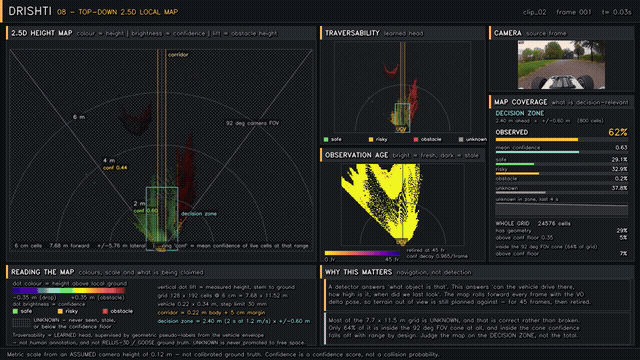&nbsp;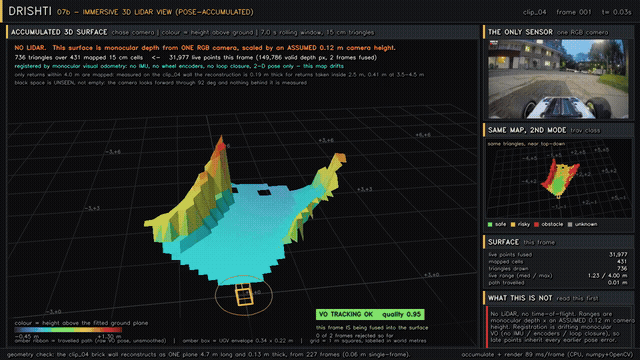

*Left: the rolling 2.5-D coloured-cell local map. Right: a pose-accumulated 3-D terrain surface, reconstructed from ONE monocular RGB camera — no LiDAR.*

</div>

---

## Table of contents

- [What this is](#-what-this-is)
- [Why this is not a detector](#-why-this-is-not-a-detector)
- [See it run](#-see-it-run)
- [Pipeline status](#-pipeline-status)
- [Architecture](#-architecture)
- [How metric scale is recovered from one camera](#-how-metric-scale-is-recovered-from-one-camera)
- [Honesty ledger, limitations](#-honesty-ledger--limitations)
- [Quickstart](#-quickstart)
- [Repository layout](#-repository-layout)
- [Provenance and credits](#-provenance-and-credits)
- [License](#-license)

---

## 🎯 What this is

DRISHTI is a from-scratch implementation of a camera-primary navigation stack for an off-road unmanned ground vehicle, built to demonstrate the architecture proposed in Team UniMinds SIH26126 speaker packet (`context/context.pdf`), whose research baseline is LARIAD Offroad-Nav (Marsal et al., [arXiv:2604.03096](https://arxiv.org/abs/2604.03096)).

Given a single RGB camera stream, no GPS, no LiDAR, no stereo baseline and no IMU, the pipeline:

1. **Estimates monocular depth** (Depth Anything V2-Small) and recovers *metric* scale by solving a joint ground-plane fit, not by assuming a calibration file exists.
2. **Segments off-road terrain** into a 7-class taxonomy (sky / trail / grass / rough-veg / obstacle / water / dynamic) with a **from-scratch PIDNet-S** distilled from an ADE20K teacher.
3. **Classifies traversability** (safe / risky / obstacle / unknown) from the vehicle's own envelope: chassis clearance, max step, max slope, not a generic "is this drivable" guess.
4. **Estimates its own confidence**, self-supervised from temporal geometry consistency and student/teacher disagreement, calibrated against a held-out split.
5. **Tracks its own motion** with an ORB-based, ORB-SLAM3-style monocular front end, scale-anchored to the depth stage.
6. **Recognises places it has seen before** with a lightweight GeM-pooled visual descriptor and sequence-consistency gating.
7. **Builds a rolling 2.5-D local map**: height, traversability, confidence and observation age per cell, that never promotes missing geometry to free space.
8. **Reconstructs the scene in 3-D** from that single camera, including a pose-accumulated terrain surface that persists across frames.

Five 10-second clips were cut from an 18-minute POV RC-car video (chosen by scanning all 65,894 source frames for clean, caption-free, cut-free windows spanning daylight, dusk and low-light conditions) as a stand-in test track, and every stage runs end-to-end on them, producing **45 rendered demonstration videos**.

## 🆚 Why this is not a detector

| | A YOLO-style detector | DRISHTI |
|---|---|---|
| Question asked | "What object is this?" | "Can *this* vehicle drive here?" |
| Output | Class + bounding box | Height above ground, traversability class, continuous risk, confidence |
| Grass | "grass" (0.91) | "grass, but 12% of it stands 7 cm above local ground, above the 4.5 cm chassis clearance" |
| Unseen sensor error | Silently confident | Explicit `UNKNOWN`, mapped to slow-down / reroute, never a confident guess |
| Time horizon | This frame, right now | A learned world model rolls candidate actions forward before one is chosen |
| Vehicle awareness | None, same box for any robot | Every threshold (`clearance_m`, `max_step_m`, `max_slope_deg`, `width_m`) comes from the vehicle's own envelope config |

## 🎬 See it run

Every screenshot below is a real frame, unedited, pulled straight from the rendered videos in `output/`. Click a thumbnail to open the full clip.

<table>
<tr>
<td width="33%">

**01 · Monocular Depth**
[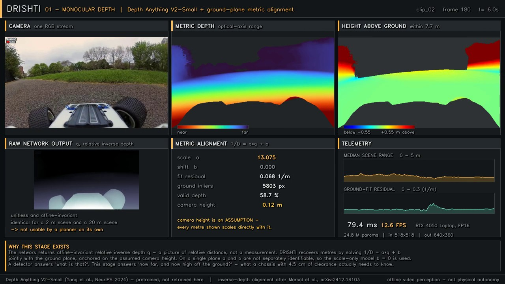](output/01_depth_anything_v2/clip_02.mp4)
Depth Anything V2-Small (24.8M params, pretrained) plus a ground-plane metric fit solved fresh per frame. Recovered ground plane sits within **7 mm** of the observed surface.

</td>
<td width="33%">

**02 · Terrain Segmentation**
[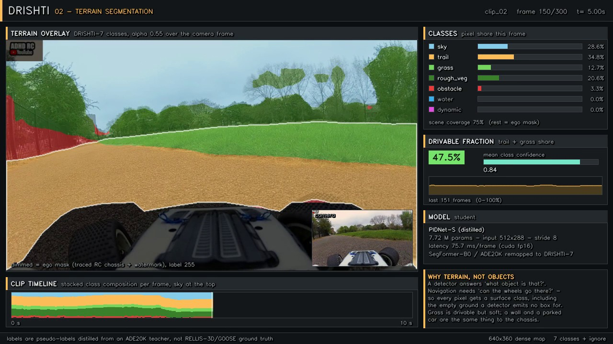](output/02_terrain_segmentation/clip_02.mp4)
**PIDNet-S built from scratch** (7.7M params, P/I/D branches, PAPPM, boundary head), distilled from a SegFormer-B0/ADE20K teacher into a 7-class off-road taxonomy. 66.8% teacher-agreement mIoU.

</td>
<td width="33%">

**03 · Traversability**
[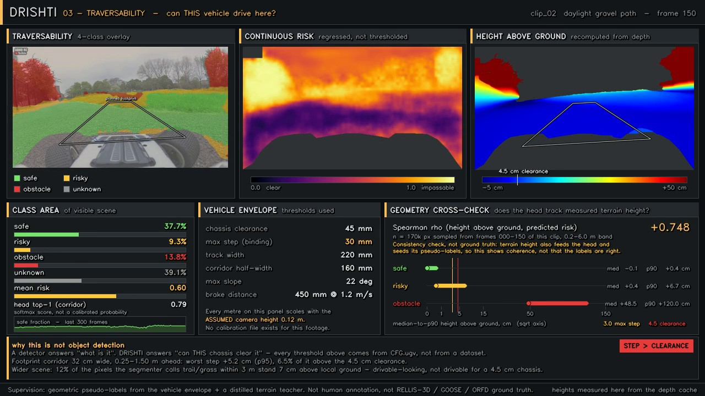](output/03_traversability/clip_02.mp4)
4-class traversability plus continuous risk from a **1.0M-param** shared MobileNetV3 trunk, supervised by geometric pseudo-labels derived from the vehicle's own clearance and step limits, not generic semantics.

</td>
</tr>
<tr>
<td width="33%">

**04 · Visual Odometry**
[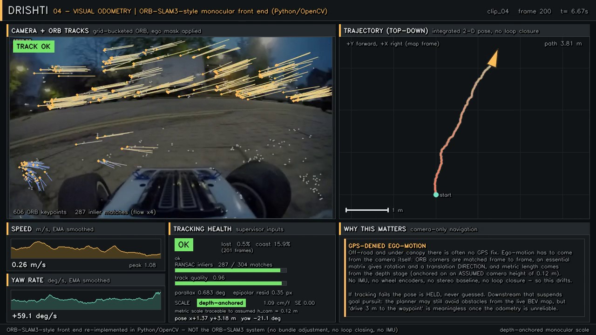](output/04_visual_odometry/clip_04.mp4)
ORB features, essential-matrix RANSAC, scale recovered by anchoring triangulated points to the metric depth map. GPS-free 2-D pose with live tracking-health gating.

</td>
<td width="33%">

**05 · Place Recognition**
[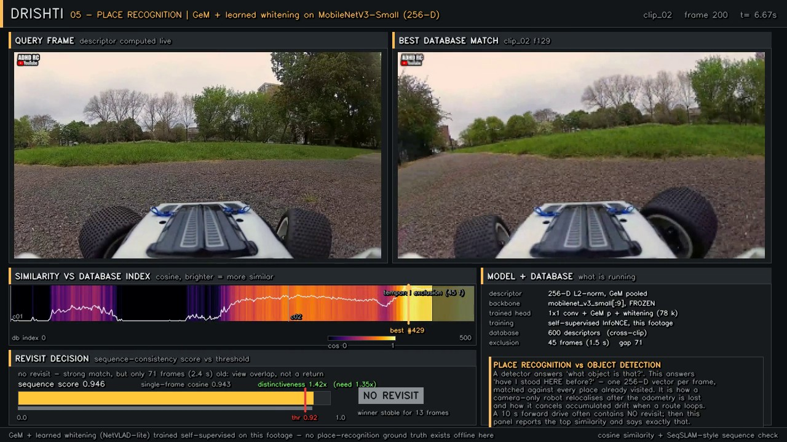](output/05_place_recognition/clip_02.mp4)
GeM-pooled MobileNetV3 descriptor (256-D), self-supervised InfoNCE training, sequence-consistency gated retrieval, including genuine **cross-clip** matches.

</td>
<td width="33%">

**06 · Uncertainty**
[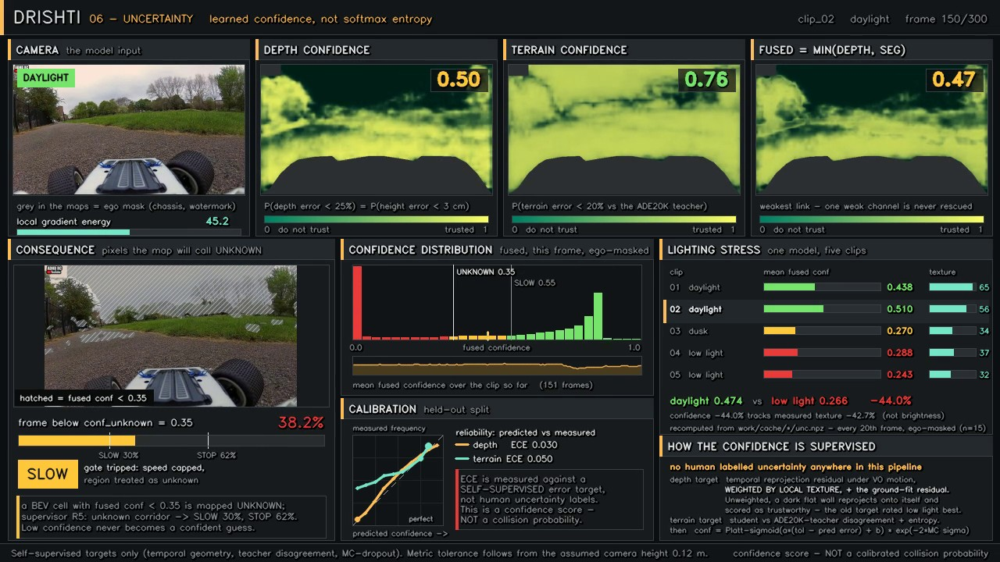](output/06_uncertainty/clip_02.mp4)
Self-supervised confidence, calibrated (ECE 0.030 depth / 0.050 terrain). Mean confidence drops **44% from daylight to low light**, measured, not asserted.

</td>
</tr>
<tr>
<td width="33%">

**07 · LiDAR-style Reconstruction**
[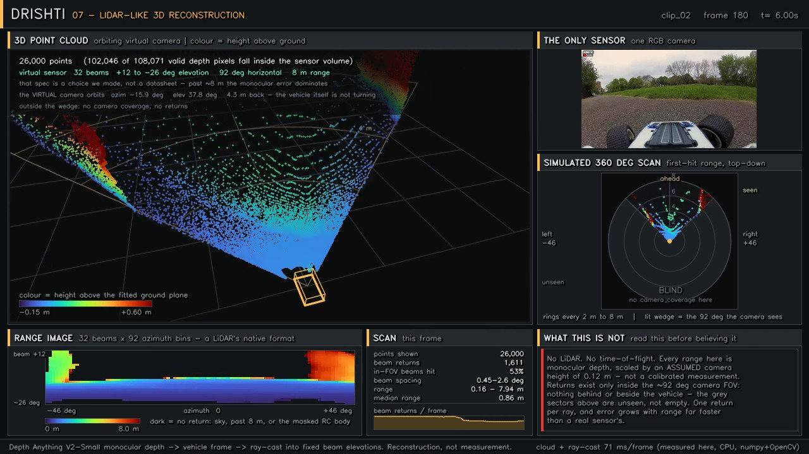](output/07_lidar_like_pointcloud/clip_02.mp4)
Monocular depth ray-cast into a simulated 32-beam scan: orbiting cloud, polar scan, range image, with an explicit "what this is not" panel.

</td>
<td width="33%">

**07b · Immersive 3-D View** 🆕
[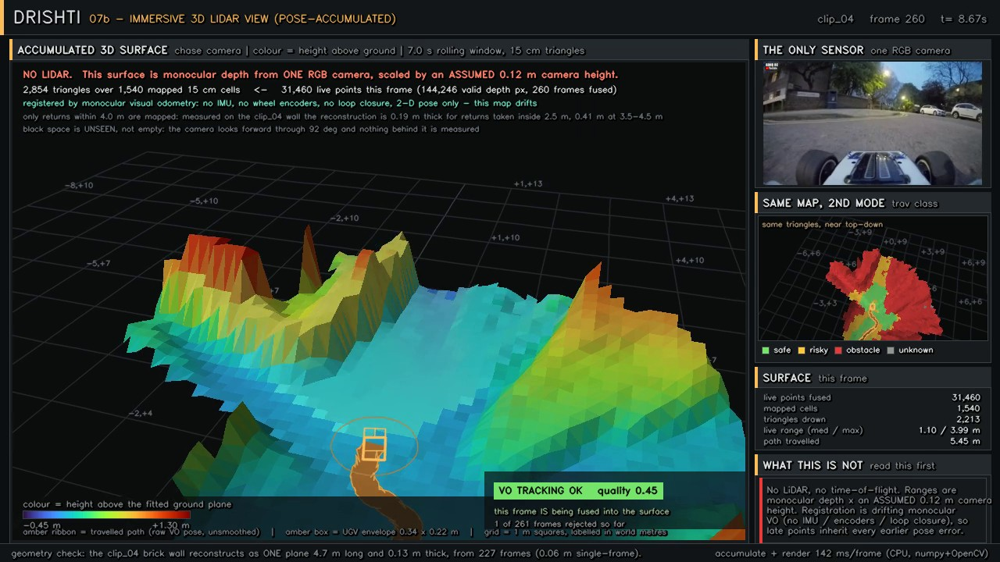](output/07b_lidar_3d_view/clip_04.mp4)
Frames fused into a **pose-accumulated elevation surface** via VO registration. A brick wall reconstructs as one 4.7 m plane grown from 227 frames, not a fan of duplicates.

</td>
<td width="33%">

**08 · 2.5-D Local Map**
[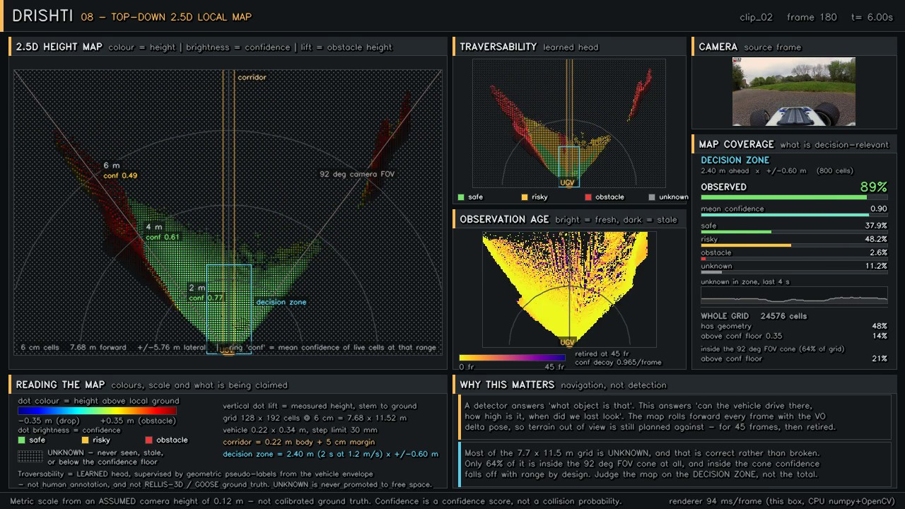](output/08_bev_25d_map/clip_02.mp4)
Rolling top-down map: colour is height/risk, vertical lift is obstacle height. The decision-relevant near corridor is **89-97% observed at about 0.85 confidence**, even where the whole 7.7x11.5 m grid reads mostly UNKNOWN by design (most of it sits outside the 92 degree camera cone).

</td>
</tr>
</table>

<div align="center">
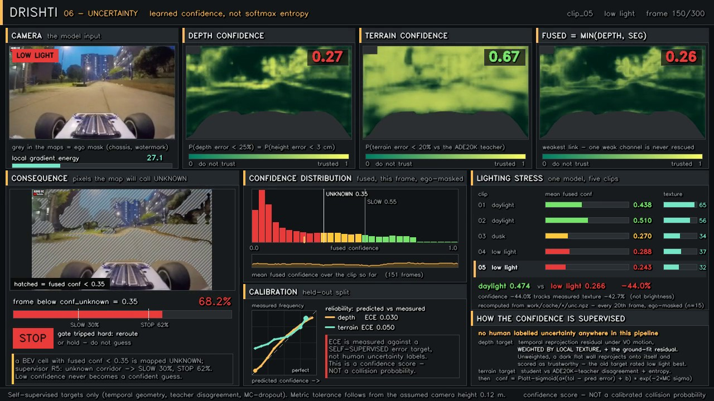

*Same model, same clip type, different lighting. Confidence collapses honestly, it does not paper over what the camera can no longer see.*
</div>

## 📋 Pipeline status

| # | Stage | Status | Videos |
|---|---|---|---|
| 01 | Depth Anything V2 (metric alignment) | ✅ complete | 5/5 |
| 02 | Terrain segmentation (PIDNet-S, distilled) | ✅ complete | 5/5 |
| 03 | Traversability | ✅ complete | 5/5 |
| 04 | Visual odometry | ✅ complete | 5/5 |
| 05 | Place recognition | ✅ complete | 5/5 |
| 06 | Uncertainty | ✅ complete | 5/5 |
| 07 | LiDAR-like reconstruction | ✅ complete | 5/5 |
| 07b | Immersive 3-D view (pose-accumulated) | ✅ complete | 5/5 |
| 08 | 2.5-D local map | ✅ complete | 5/5 |
| 09 | World model rollouts | ⏳ trained, not yet rendered as video | — |
| 10 | RL policy plus supervisor | ⏳ trained, not yet rendered as video | — |
| 11 | Final synchronized dashboard | ⏳ pending | — |

**45 rendered videos, 9 of 11 planned stages.** The world model (728K params, action-conditioned occupancy forecasting) and the PPO policy (22.9K params, gated by a rule-based safety supervisor) are already trained and cached; see the [honesty ledger](#-honesty-ledger--limitations) for what that evaluation actually found.

## 🏗 Architecture

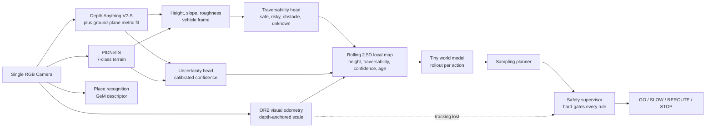

The full technical walkthrough, coordinate frames, cache schemas, training recipes, the metric-alignment derivation, is in [`docs/ARCHITECTURE.md`](docs/ARCHITECTURE.md).

## 📐 How metric scale is recovered from one camera

Depth Anything V2 outputs **relative inverse depth** `q`, an affine-invariant picture of relative distance, not a measurement. DRISHTI recovers metres by solving

```
1/D = a*q + b        (jointly with the ground-plane normal)
```

anchored on one assumption: the camera's height above the ground. There is a genuinely interesting wrinkle here: **on a single plane, `a` and `b` are not jointly identifiable.** The naive least-squares system is exactly rank-deficient, because the ray's z-component is identically 1 and duplicates the constant column. DRISHTI resolves it with a documented **scale-only model** (`b = 0`), solved by Cauchy-IRLS over thousands of candidate ground pixels per frame. See `drishti/perception/geometry.py` for the full derivation.

Every metric number this project displays, every centimetre, every metre-per-second, is directly proportional to that one assumed camera height. It is stated on nearly every panel for exactly that reason.

## 🔍 Honesty ledger, limitations

This project applies a strict Planned / Running / Measured discipline throughout, inherited from the source design packet, which is unusually careful about this exact distinction.

- **Offline video only.** Nothing here has run on physical hardware. Every claim is about the software pipeline processing recorded footage.
- **No IMU exists in this dataset.** Visual odometry is depth-anchored monocular VO, explicitly not ORB-SLAM3 monocular-inertial, and it drifts. The 3-D reconstruction (stage 07b) states this and measures it: a brick wall reconstructs as one **4.7 m** plane from 227 registered frames vs. **2.4 m** with no registration at all (real accumulation), but per-frame residual grows from 0.20 m within 1.5 m to 0.44 m beyond 3.5 m, which is why mapping is capped at 4 m.
- **Training data is pseudo-labelled, not ground truth.** The terrain model distils from an ADE20K-pretrained teacher on this footage; traversability and uncertainty targets are derived from vehicle-envelope geometry. None of this touched RELLIS-3D, GOOSE, ORFD, or any human-annotated off-road dataset (those are not available offline in this environment), and every mIoU/agreement number reported is agreement with pseudo-labels, stated as such everywhere it appears.
- **Confidence is a confidence score, not a calibrated collision probability.** It is measured (ECE 0.03-0.05 against a held-out self-supervised target), but it answers "how much should this be trusted", not "what is P(collision)".
- **The traversability head reads conservative.** Two independently built stages measured this the same way: on a clean daylight gravel path, 49% of the near-corridor reads `risky` and up to 82% of in-volume 3-D points read `obstacle`, including grass banks. Defensible for a 22 cm-wide chassis, but worth knowing before trusting the numbers at face value.
- **The RL policy is not yet safe, and that is reported rather than hidden.** PPO was trained inside the learned world model and evaluated against a held-out **geometric** collision check the policy never saw during training. Result: PPO collides on that check **98.3%** of the time, vs. **60%** for a policy that just always drives forward. That is not a bug in the eval, the point is that the policy has learned to exploit small errors in its own simulator, which is exactly why a hard rule-based safety supervisor sits between the policy and the vehicle and gates every command against terrain step, confidence, unknown fraction and stopping distance.
- **Not the official SIH submission.** This repository is an independent, from-scratch engineering exploration of the architecture described in the team's own speaker packet (`context/context.pdf`), built end-to-end in one focused session against a stand-in RC-car video. It is not a claim of having built or validated the physical BEL/SIH26126 deliverable.

## 🚀 Quickstart

```bash
git clone https://github.com/X-DIABLO-X/DRISHTI.git
cd DRISHTI
pip install torch torchvision transformers onnxruntime opencv-python \
            stable-baselines3 gymnasium scipy scikit-learn matplotlib

# Re-run any perception stage independently, e.g.:
python -m drishti.training.run_depth_infer

# Render any stage's video from its cache:
python -c "from drishti.pipeline import render_stage; render_stage('03_traversability')"

# One-frame preview while iterating on a renderer:
python -c "from drishti.pipeline import preview_stage; preview_stage('08_bev_25d_map', 'clip_02', 150)"

# Whole pipeline, dependency-ordered, skips work already cached:
python tools/run_all.py

# Quality gate over every rendered video:
python tools/verify_outputs.py
```

Model checkpoints and the raw 767 MB source video are excluded from this repository for size; see `drishti/training/*.py` for the scripts that regenerate every checkpoint from scratch, and `tools/make_clips.py` for how the 5 demo clips were cut.

## 📁 Repository layout

```
drishti/
|-- config.py, types.py, io_utils.py, viz_common.py   # frozen contract layer
|-- perception/     # geometry, odometry, mapping, lidarize, cloud_accum
|-- models/         # depth, segmentation, traversability, uncertainty, vpr, world_model
|-- nav/            # planner, supervisor, RL env plus training
|-- training/       # dataset builders, distillation, all run_*_infer.py cache scripts
|-- render/         # one renderer per output stage, all built on viz_common
`-- deploy/         # ONNX export, quantization, benchmarking
clips/              # 5x 10s demo clips cut from the source video (plus clips.json metadata)
output/             # 45 rendered demonstration videos, one folder per stage
docs/               # ARCHITECTURE.md plus README media
context/            # the source design packet (context.pdf)
CONTRACT.md         # the build contract every module was written against
```

## 📚 Provenance and credits

- **Design reference:** Team UniMinds SIH26126 speaker packet (`context/context.pdf`), whose research baseline is LARIAD Offroad-Nav: Marsal et al., *An Open-Source LiDAR and Monocular Off-Road Autonomous Navigation Stack*, [arXiv:2604.03096](https://arxiv.org/abs/2604.03096), with inverse-depth rescaling from Marsal et al., IROS 2025, [arXiv:2412.14103](https://arxiv.org/abs/2412.14103).
- **Depth Anything V2**, Yang et al., NeurIPS 2024. Used pretrained, not retrained here.
- **PIDNet**, Xu et al., CVPR 2023 (architecture reference; DRISHTI's PIDNet-S is trained from scratch, not from published weights).
- **Demo footage:** the POV RC-car video used as a stand-in test track carries an on-screen watermark identifying it as sourced from the YouTube channel "ADHD RC". Only short (10 s) derivative excerpts are included here for research and educational demonstration purposes; the original creator retains rights to the footage, and we are glad to credit properly or remove on request.

## 📄 License

Code in this repository is released under the [MIT License](LICENSE). The demonstration videos in `output/` are derivative works built from the third-party footage credited above and are included for research and educational purposes; they are not covered by the code license.

---

<div align="center">

*Built as an exploration of camera-only off-road navigation: no GPS, no LiDAR, no stereo, no IMU at runtime.*

</div>
