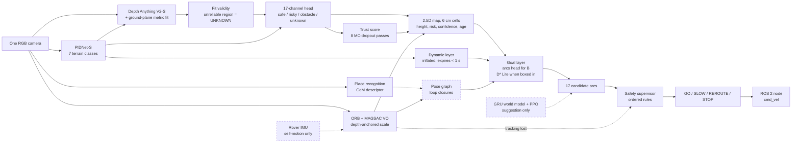

<div align="center">

# 🧭 DRISHTI
### Vision-based autonomous navigation for an unmanned ground vehicle, outdoors: no GPS, no map, one camera

*Not "what object is this?" — but "can this vehicle drive here, how high is the terrain, how confident are we, and what happens if we take this path?"*

**Smart India Hackathon 2026 · Team UniMinds (Team ID 152431) · Problem Statement SIH26126**

[](https://www.python.org/)
[](https://pytorch.org/)
[](ros2/drishti_ros)
[](LICENSE)
[](#-pipeline-status)
[](#-see-it-run)
[](#-point-a--point-b)

&nbsp;

*Left: the rolling 2.5-D coloured-cell local map. Right: a pose-accumulated 3-D terrain surface, reconstructed from ONE monocular RGB camera — no LiDAR.*

### 🎥 Demo video

[](https://youtu.be/WvS2KiZxC6I)

*Click to watch on YouTube.*

### ▶ [Watch the 60-second highlight reel](output/final_demo.mp4) · 📑 [Read the SIH26126 presentation](docs/SIH26126_UniMinds_DRISHTI.pdf)

</div>

---

## Table of contents

- [Team and problem statement](#-team-and-problem-statement)
- [What this is](#-what-this-is)
- [How DRISHTI meets the three PS challenges](#-how-drishti-meets-the-three-ps-challenges)
- [Why this is not a detector](#-why-this-is-not-a-detector)
- [See it run](#-see-it-run)
- [Point A → Point B](#-point-a--point-b)
- [Learned suggests, rules decide](#-learned-suggests-rules-decide)
- [Pipeline status](#-pipeline-status)
- [Architecture](#-architecture)
- [How metric scale is recovered from one camera](#-how-metric-scale-is-recovered-from-one-camera)
- [Vehicle geometry as parameters](#-vehicle-geometry-as-parameters)
- [From footage to field](#-from-footage-to-field)
- [By the numbers](#-by-the-numbers)
- [Feasibility and viability](#-feasibility-and-viability)
- [Technology stack](#-technology-stack)
- [Honesty ledger, limitations](#-honesty-ledger--limitations)
- [Quickstart](#-quickstart)
- [Repository layout](#-repository-layout)
- [Research and references](#-research-and-references)
- [Provenance and credits](#-provenance-and-credits)
- [License](#-license)

---

## 👥 Team and problem statement

| | |
|---|---|
| **Problem statement** | SIH26126: *Vision Based Autonomous Navigation for Unmanned Ground Vehicle for Outdoor Environment* |
| **Theme / category** | Smart Automation · Software |
| **Team** | UniMinds (Team ID 152431) |
| **Team lead** | Juhil Modi |
| **Members** | Saswata Das, Harshit Tiwari, Rohan Jangam, Ritesh Prajapati, Sanskriti |
| **Presentation** | [`docs/SIH26126_UniMinds_DRISHTI.pdf`](docs/SIH26126_UniMinds_DRISHTI.pdf) |

**The problem.** The UGV must reach Point B outdoors where GPS is jammed or blocked and no map exists. A LiDAR costs about USD 4,000; one RGB camera costs USD 25 and sees the scene in rich detail. **The hard part:** a photo has no distance. DRISHTI has to turn pixels into distance, terrain height, safe ground, its own motion and a stop decision.

## 🎯 What this is

DRISHTI is a from-scratch, camera-primary navigation stack for an off-road unmanned ground vehicle. Its research blueprint is LARIAD Offroad-Nav (Marsal et al., [arXiv:2604.03096](https://arxiv.org/abs/2604.03096)).

From a single RGB camera, with no GPS, no LiDAR, no stereo baseline and no prior map, the pipeline:

1. **Estimates monocular depth** (Depth Anything V2-Small) and recovers *metric* scale by solving a joint ground-plane fit. Where that fit is unreliable, the region is marked **invalid and treated as unknown**.
2. **Segments off-road terrain** into seven classes (sky / trail / grass / rough vegetation / obstacle / water / dynamic) with a **from-scratch PIDNet-S** distilled from a SegFormer teacher.
3. **Classifies traversability** (safe / risky / obstacle / unknown) with a 17-channel MobileNetV3 head, judged against the vehicle's own clearance and step limits rather than a generic "is this drivable" guess.
4. **Estimates its own trust** with eight Monte-Carlo dropout passes, calibrated against a held-out split.
5. **Tracks its own motion**: corner features tracked frame to frame, filtered by MAGSAC and scaled by the depth estimate.
6. **Recognises places it has seen before** with a GeM-pooled visual descriptor. On the rover, verified loop closures feed a **pose graph** (GTSAM or the built-in solver).
7. **Builds a rolling 2.5-D map of 6 cm cells**: height, risk, confidence and age. It never promotes missing geometry to free space.
8. **Drives from Point A to Point B**. 17 candidate arcs head straight for B on open ground. When the vehicle is boxed in, **D\* Lite** replans a way round over the ground seen so far, where unseen ground has a cost but is never treated as free.
9. **Handles moving obstacles**: a person or animal is marked as dynamic cells that are inflated and **expire in under one second**, which forces a replan.
10. **Gates every command** through an ordered, rule-based safety supervisor: **GO, SLOW, REROUTE or STOP**, each with the rule that fired and a human-readable reason.
11. Runs as **one Python module** (`drishti/runtime.py`, from depth to supervisor), wrapped as a **ROS 2 node** (camera in, `cmd_vel` out) for Gazebo Harmonic and the rover.

On the rover, a **built-in IMU senses self-motion only**. It corrects metric scale and heading drift; it is never a world sensor.

Five 10-second clips were cut from an 18-minute POV RC-car video to serve as a stand-in test track. They cover daylight, dusk and low light, and were chosen by scanning all 65,894 source frames for clean, caption-free, cut-free windows. Every perception stage runs end to end on them, producing **45 rendered, verified demonstration videos**.

## 🧩 How DRISHTI meets the three PS challenges

| Path detection | Visual localization | Collision avoidance & A→B |
|---|---|---|
| Depth, a PIDNet-S terrain model and a 17-channel head mark each region **safe, risky, obstacle or unknown**. Seven classes: trail, grass, rough vegetation, obstacle, water, sky, dynamic. Judged against the vehicle's own clearance and step limits. | Corner features tracked frame to frame, filtered by **MAGSAC** and scaled by the depth estimate. Rolling 2.5D map of 6 cm cells: height, risk, confidence, age. Place recognition closes loops; the rover's built-in IMU fixes scale and drift. | Arcs head straight for Point B on open ground. Boxed in? **D\* Lite** replans a way round over the ground seen so far; unseen ground costs, never free. A person or animal steps in: dynamic cells are inflated and expire in under 1 s, forcing a replan. **Safety gate on every command: GO, SLOW, REROUTE or STOP.** |

## 🆚 Why this is not a detector

| | A YOLO-style detector | DRISHTI |
|---|---|---|
| Question asked | "What object is this?" | "Can *this* vehicle drive here, and how do I get to B?" |
| Output | Class + bounding box | Height above ground, traversability class, continuous risk, confidence, a command |
| Grass | "grass" (0.91) | "grass, but 12% of it stands 7 cm above local ground, above the 4.5 cm chassis clearance" |
| Unseen sensor error | Silently confident | Explicit `UNKNOWN`, mapped to slow-down / reroute, never a confident guess |
| A person steps in | Box on this frame | Inflated dynamic cells with a sub-second expiry; the route is replanned |
| Time horizon | This frame, right now | 17 arcs rolled 2 s forward against the map; D\* Lite for the route beyond |
| Vehicle awareness | None, same box for any robot | Every threshold (`clearance_m`, `max_step_m`, `max_slope_deg`, `width_m`) comes from the vehicle profile |

### What makes DRISHTI's approach different

| Traditional approach | DRISHTI approach |
|---|---|
| GPS / LiDAR dependent | One RGB camera, GPS-free |
| Plans on a map it does not have | Heads for B, replans as it sees |
| Names objects, not limits | Vehicle-aware decisions |
| Treats unseen ground as free | Unseen ground is never free |

## 🎬 See it run

Every screenshot below is a real frame, unedited, pulled straight from the rendered videos in `output/`. Click a thumbnail to open the full clip.

<table>
<tr>
<td width="33%">

**01 · Monocular Depth**
[](output/01_depth_anything_v2/clip_02.mp4)
Depth Anything V2-Small (24.8M params, pretrained) plus a ground-plane metric fit solved fresh per frame. Recovered ground plane sits within **7 mm** of the observed surface.

</td>
<td width="33%">

**02 · Terrain Segmentation**
[](output/02_terrain_segmentation/clip_02.mp4)
**PIDNet-S built from scratch** (7.7M params, P/I/D branches, PAPPM, boundary head), distilled from a SegFormer-B0/ADE20K teacher into a 7-class off-road taxonomy: **66.83% mIoU, 89.64% pixel agreement** with the teacher.

</td>
<td width="33%">

**03 · Traversability**
[](output/03_traversability/clip_02.mp4)
4-class traversability plus continuous risk from a **1.0M-param** shared MobileNetV3 trunk with a 17-channel input stack, supervised by geometric pseudo-labels derived from the vehicle's own clearance and step limits, not generic semantics.

</td>
</tr>
<tr>
<td width="33%">

**04 · Visual Odometry**
[](output/04_visual_odometry/clip_04.mp4)
ORB features, essential matrix with MAGSAC, scale recovered by anchoring triangulated points to the metric depth map. GPS-free 2-D pose with live tracking-health gating.

</td>
<td width="33%">

**05 · Place Recognition**
[](output/05_place_recognition/clip_02.mp4)
GeM-pooled MobileNetV3 descriptor (256-D), self-supervised InfoNCE training, sequence-consistency gated retrieval, including genuine **cross-clip** matches.

</td>
<td width="33%">

**06 · Uncertainty**
[](output/06_uncertainty/clip_02.mp4)
Self-supervised trust score with eight MC-dropout passes, calibrated (ECE 0.030 depth / 0.050 terrain). Mean trust drops from **0.48 to 0.27 (-44%) from daylight to low light**, measured, not asserted.

</td>
</tr>
<tr>
<td width="33%">

**07 · LiDAR-style Reconstruction**
[](output/07_lidar_like_pointcloud/clip_02.mp4)
Monocular depth ray-cast into a simulated 32-beam scan: orbiting cloud, polar scan, range image, with an explicit "what this is not" panel.

</td>
<td width="33%">

**07b · Immersive 3-D View**
[](output/07b_lidar_3d_view/clip_04.mp4)
Frames fused into a **pose-accumulated elevation surface** via VO registration. A brick wall reconstructs as one 4.7 m plane grown from 227 frames, not a fan of duplicates.

</td>
<td width="33%">

**08 · 2.5-D Local Map**
[](output/08_bev_25d_map/clip_02.mp4)
Rolling top-down map of 6 cm cells: colour is height/risk, vertical lift is obstacle height. The decision-relevant near corridor is **89-97% observed at about 0.85 confidence**, even where the whole 7.7x11.5 m grid reads mostly UNKNOWN by design (most of it sits outside the 92 degree camera cone).

</td>
</tr>
</table>

<div align="center">


*Same model, same clip type, different lighting. Trust collapses honestly; it does not paper over what the camera can no longer see.*
</div>

## 🎯 Point A → Point B

The recorded footage has no Point B and no ground-truth map, so goal-directed driving is exercised in closed loop instead. That loop drives the **real runtime** (`drishti/runtime.py`: goal layer, D\* Lite, the 17 arcs, the supervisor, the dynamic layer) through a ground-truth occupancy map. The 2.5-D state is rendered through the same 92° / 6.5 m view cone with occlusion and the same 1.5 s map memory. **There is no camera network in this loop**: it tests decisions and replanning, not perception.

```
python tools/sim_goal_nav.py          # 6 scenarios x 3 seeds -> logs/sim_goal_nav.json
```

| Scenario | What it tests | Success | Collisions | Interventions |
|---|---|---|---|---|
| `open` | arcs head straight for B | 3/3 | 0 | 0 |
| `wall` | a 3 m wall across the straight line | 3/3 | 0 | 0 |
| `dead_end` | a U-pocket opening towards the start | 3/3 | 0 | 0 |
| `pedestrian` | a person crosses ~1 m ahead; dynamic cells, expiry, replan | 3/3 | 0 | 0 |
| `slalom` | three staggered walls, repeated replanning | 3/3 | 0 | 0 |
| `trap` | a 10 m corridor towards B whose closed end is out of view until the vehicle is committed; it has to turn round and go outside | 3/3 | 0 | 0 |
| **All** | | **18/18 (100%)** | **0** | **0** |

The median control cycle in this loop is ~30 ms on a CPU (navigation half only, measured in this repository's build container). The worst case is ~0.5 s, when the trap's closed end is first seen and D\* Lite repairs a large part of its tree; that work is capped per cycle and resumes on the next one. The same three metrics are scored in **Gazebo Harmonic** by `ros2/drishti_ros` (see [From footage to field](#-from-footage-to-field)).

**How one cycle works** (`drishti/nav/goal_planner.py`):

1. Fold the current 2.5-D state into a world-fixed 0.12 m grid of "the ground seen so far". Seen-safe costs 1 per metre, risky 2.5, **unseen or low-confidence 4 (it costs, it is never free)**, obstacles are infinite and footprint-inflated, and a soft inflation band keeps routes centred.
2. **Open ground**: the straight line to B is observed and clear, so the arcs score progress towards B itself.
3. **Boxed in**: D\* Lite (Koenig & Likhachev 2002) searches back from B; the arcs head for a 1.6 m look-ahead point on that route. Only the cells that changed are repaired: a newly seen wall, a person stepping in, a dynamic cell expiring.
4. Ground the rolling map has already forgotten is recalled from the global grid at *reduced* confidence, so the vehicle can turn round over ground it has seen, but slows while it relies on memory.
5. The supervisor still decides. The goal layer chooses a direction; it never overrides a safety rule.

## 🧠 Learned suggests, rules decide

A PPO policy trained inside DRISHTI's own GRU world model drove further than a naive baseline. But on **60 held-out states**, checked against a geometric collision test it never saw in training, it collided **98.3%** of the time; a policy that always drives forward collided 60% of the time. The policy had learned to exploit errors in its own simulator.

So learning only **suggests**, and the rule-based supervisor **decides**. Over the 1,500 recorded frames, the supervisor overrode the policy's action on **933 frames (62%)**. Every decision stores the rule that fired (R1–R8, plus G0–G2 for goal-level stops) and a human-readable reason. In the live runtime the policy is off by default (`use_policy=False`).

## 📋 Pipeline status

| # | Stage | Status | Evidence |
|---|---|---|---|
| 01 | Depth Anything V2 (metric alignment, fit-validity gating) | ✅ complete | 5/5 videos |
| 02 | Terrain segmentation (PIDNet-S, distilled) | ✅ complete | 5/5 videos |
| 03 | Traversability (17-channel head) | ✅ complete | 5/5 videos |
| 04 | Visual odometry (ORB + MAGSAC) | ✅ complete | 5/5 videos |
| 05 | Place recognition | ✅ complete | 5/5 videos |
| 06 | Uncertainty / trust (8 MC-dropout passes) | ✅ complete | 5/5 videos |
| 07 | LiDAR-like reconstruction | ✅ complete | 5/5 videos |
| 07b | Immersive 3-D view (pose-accumulated) | ✅ complete | 5/5 videos |
| 08 | 2.5-D local map | ✅ complete | 5/5 videos |
| 09 | World model rollouts (GRU) | ⏳ trained, not yet rendered as video | logs |
| 10 | RL policy plus supervisor | ⏳ trained, not yet rendered as video | logs |
| 11 | Final synchronized dashboard | ⏳ pending | — |
| — | Goal layer: Point B, D\* Lite, dynamic obstacles | ✅ implemented | 18/18 sim episodes, unit tests |
| — | Rover IMU fusion, loop closure + pose graph | ✅ implemented | unit tests on synthetic data |
| — | Live runtime + ROS 2 node + Gazebo Harmonic world | ✅ implemented | not yet run in Gazebo in this repo |
| — | WAVE ROVER field trials | ⏳ planned | — |

**45 rendered videos across 9 of 11 planned stages.** The world model (728K params, action-conditioned occupancy forecasting) and the PPO policy (22.9K params, gated by the supervisor) are trained and cached.

## 🏗 Architecture



**DRISHTI end to end:** one RGB frame → metric depth → terrain & traversability → odometry & 2.5D map → 17 arcs + safety supervisor → GO · SLOW · REROUTE · STOP.

The full technical walkthrough is in [`docs/ARCHITECTURE.md`](docs/ARCHITECTURE.md): coordinate frames, cache schemas, training recipes, the metric-alignment derivation, the rule tables and the new navigation modules.

## 📐 How metric scale is recovered from one camera

Depth Anything V2 outputs **relative inverse depth** `q`, an affine-invariant picture of relative distance, not a measurement. DRISHTI recovers metres by solving

```
1/D = a*q + b        (jointly with the ground-plane normal)
```

anchored on one assumption: the camera's height above the ground (12 cm). There is a genuinely interesting wrinkle here: **on a single plane, `a` and `b` are not jointly identifiable.** The naive least-squares system is exactly rank-deficient, because the ray's z-component is identically 1 and duplicates the constant column. DRISHTI resolves it with a documented **scale-only model** (`b = 0`), solved by SVD with Cauchy-IRLS over thousands of candidate ground pixels per frame. See `drishti/perception/geometry.py` for the full derivation. It is the idea of Marsal et al. (IROS 2025), anchored on the ground instead of an IMU.

**Where the ground fit is unreliable, the region is marked invalid** (`drishti/perception/fit_validity.py`). A failed fit may reuse the last good one for at most 0.5 s; after that, or with no good fit yet, the whole frame is invalid. Within a frame, ground-labelled tiles whose depth disagrees with the plane by more than 30% are dropped. Invalid depth becomes UNKNOWN in the map, so the vehicle slows or reroutes; it never reads that region as free.

Every metric number this project displays, every centimetre and every metre-per-second, is directly proportional to that one assumed camera height, and it is stated on nearly every panel for exactly that reason. On the rover, the IMU's accelerometer gives an independent metric check (see below).

## 🚙 Vehicle geometry as parameters

Camera height, clearance and step limit are **software settings**, so the same visual evidence can be judged for a different vehicle **without retraining**. The networks never see the vehicle; they output depth, terrain and risk, and drivability is decided afterwards against the profile in `configs/vehicles/`:

| Profile | Camera height | Clearance | Step limit | Notes |
|---|---|---|---|---|
| `rc_pov` | 12 cm | 4.5 cm | 3 cm | the RC car in the footage; every cached result used these |
| `wave_rover` | 12 cm | 4.5 cm | 3 cm | target rover; 0.6 m/s first-trial speed cap |
| `example_large_ugv` | 60 cm | 20 cm | 15 cm | *illustrative only*: the same 10 cm step that stops the rover is drivable here |

```python
from drishti.vehicles import apply_vehicle_profile
apply_vehicle_profile("wave_rover")        # or DRISHTI_VEHICLE=wave_rover
```

`tests/test_fit_validity_vehicles.py::test_same_evidence_judged_per_vehicle` checks exactly that claim: one map with a 10 cm step, two profiles, two verdicts.

## 🛰 From footage to field

| | On the recorded footage | On the rover (WAVE ROVER + Jetson Orin Nano Super + one camera, ≈ USD 365 all in) |
|---|---|---|
| **Scale** | ground-plane fit on an assumed 12 cm camera height | the same, plus the **built-in IMU**: VO speed changes regressed against accelerometer speed changes (`perception/imu_fusion.py`) |
| **Heading drift** | VO only | complementary filter: bias-corrected gyro short-term, VO long-term; the gyro carries heading through VO dropouts |
| **Loop closure** | none (ORB-SLAM3-style front end without IMU or loop closure) | VPR revisit → PnP-RANSAC geometric check → **pose graph** (GTSAM, or the built-in Gauss-Newton). A χ² gate against propagated odometry drift rejects false loops (`perception/pose_graph.py`, `loop_closure.py`) |
| **Point A → B** | — | 17 arcs head for B; D\* Lite replans around dead ends every cycle |
| **Runtime** | cached, clip by clip, for rendering | `drishti/runtime.py`, frame by frame, wrapped as `ros2/drishti_ros` |
| **Proving ground** | 45 rendered videos | **Gazebo Harmonic** world (dead end, kerb, rocks, a walking pedestrian), scored on success rate, collisions and interventions; then the rover |

**Measured on synthetic data** (unit tests, `python -m <module>` self-tests):

- IMU fusion recovers a deliberately wrong 2× VO scale (to 1.98), and cuts heading drift under a biased gyro from 18° to 11°.
- The pose graph cuts end-point error after a 16 m loop from 0.71 m to 0.01 m (built-in solver) and from 0.87 m to 0.03 m (GTSAM). In both, a planted false loop is rejected.

```bash
# Gazebo Harmonic + ROS 2 Jazzy (see ros2/drishti_ros/README.md)
colcon build --packages-select drishti_ros && source install/setup.bash
ros2 launch drishti_ros sim.launch.py drishti_root:=$PWD
```

## 🔢 By the numbers

| | |
|---|---|
| **0** | GNSS signals in the control loop: nothing to jam, nothing to spoof |
| **62%** | 933 of 1,500 frames where the supervisor replaced the policy's action |
| **44%** | measured trust-score drop in low light (0.48 → 0.27); weak evidence slows the vehicle |
| **4×** | smaller terrain model after INT8 (30.5 MB → 8.0 MB) at 92% mIoU agreement with FP32 |
| **46 ms** | terrain stage per frame, end to end, on a laptop RTX 4050 (measured, best of a contended run) |
| **7.7M** | PIDNet-S terrain network parameters |
| **18/18** | Point A → B episodes reached in the closed-loop decision sim, 0 collisions |

## 💰 Feasibility and viability

**The industry has already chosen cameras.** In 2021 Tesla dropped radar and moved Model 3/Y to camera-only "Tesla Vision"; in 2022 the ultrasonic sensors went too, and Tesla reports that active-safety ratings were maintained or improved. Its Optimus robot runs the same camera-driven stack. In 2026, Depth Anything V2 with mono-inertial SLAM matched the success rate of a 128-beam LiDAR in real off-road trials (Marsal et al., arXiv:2604.03096). DRISHTI makes the same bet on the ground: one camera, off-road, GPS-denied.

**Cheaper, lighter, accurate where it counts** (*figures quoted in the presentation, not measured in this repository*):

- **Production cost: ~15× cheaper.** Camera + Jetson Orin Nano Super ≈ USD 274, against ≈ USD 4,000 for one 16-beam 3D LiDAR (VLP-16) alone. The whole rover is about USD 365.
- **Battery and reliability:** the models are sized for the 7–25 W Jetson-class power envelope. Less power spent on sensing means more battery left for driving, and fewer parts to fail in the field.
- **Accuracy:** depth foundation models now learn from 62M+ images. DRISHTI adds what a point cloud lacks: a vehicle-aware safe / risky / obstacle / unknown call for every 6 cm cell.

**Cheap enough to lose, cheap enough to swarm.**

- **Defence:** attritable by design; losing a unit is a line item, not a crisis.
- **Patrol:** swarms on borders and perimeters; many low-cost units cover more ground than one costly vehicle.
- **Rescue:** send a swarm into a landslide zone before people.
- **Agriculture:** priced for farmers, not fleets; navigation under crop canopy without a LiDAR bill.

**What changes when it deploys.**

- People are kept out of the first metre of danger.
- Autonomy becomes something a budget can buy.
- The value stays in software that can be built and maintained in India.
- Rule-level logs let operators, testers and certifiers see exactly why the vehicle stopped.

## 🧰 Technology stack

| Layer | Components |
|---|---|
| Language & core | Python, NumPy, SciPy |
| Libraries | PyTorch, OpenCV, ONNX Runtime, Stable-Baselines3 (PPO), GTSAM (optional) |
| Models | Depth Anything V2-Small, PIDNet-S, SegFormer-B0 (teacher), MobileNetV3-Small, GRU world model |
| Navigation & deployment | D\* Lite, ROS 2 Jazzy, Gazebo Harmonic, Jetson Orin Nano Super, WAVE ROVER |

## 🔍 Honesty ledger, limitations

This project applies a strict Planned / Running / Measured discipline throughout.

- **Perception is offline video only.** Every perception number is about the software pipeline processing recorded footage. Nothing has run on physical hardware yet.
- **The Point A → B results come from a decision-level simulator, not a camera.** `tools/sim_goal_nav.py` renders the 2.5-D state from a ground-truth map: no depth network, no terrain network, perfect odometry. 18/18 means the goal layer, D\* Lite, the arcs and the supervisor make the right decisions given a correct map. It does not mean the full stack reaches B from pixels.
- **The ROS 2 package and the Gazebo world are written but have not been run in this repository's build environment.** The pure-Python parts (frame conversions, image decoding, wheel mixing) are unit-tested; the node, the launch files and the bridge mapping await a ROS 2 Jazzy + Gazebo Harmonic machine. The WAVE ROVER serial bridge has not been run on hardware, and its JSON command format is a parameter to check against your firmware.
- **There is no IMU in the footage.** On the clips, visual odometry is depth-anchored monocular VO, explicitly not ORB-SLAM3 monocular-inertial, and it drifts. The IMU fusion and pose-graph loop closure are implemented for the rover and tested on synthetic trajectories only. The 3-D reconstruction (stage 07b) measures the drift: a brick wall reconstructs as one **4.7 m** plane from 227 registered frames vs. **2.4 m** with no registration at all. Per-frame residual grows from 0.20 m within 1.5 m to 0.44 m beyond 3.5 m, which is why mapping is capped at 4 m.
- **Training data is pseudo-labelled, not ground truth.** The terrain model distils from an ADE20K-pretrained teacher on this footage. Traversability and uncertainty targets are derived from vehicle-envelope geometry. None of this touched RELLIS-3D, GOOSE, ORFD or any human-annotated off-road dataset. Every mIoU or agreement number reported is agreement with pseudo-labels, stated as such everywhere it appears.
- **The trust score is a confidence score, not a calibrated collision probability.** It is measured (ECE 0.03–0.05 against a held-out self-supervised target), but it answers "how much should this be trusted", not "what is P(collision)".
- **The traversability head reads conservative.** On a clean daylight gravel path, 49% of the near corridor reads `risky`, and up to 82% of in-volume 3-D points read `obstacle`, including grass banks.
- **The RL policy is not safe, and that is reported rather than hidden.** It collides 98.3% of the time on held-out states, which is why it only ever suggests (see [Learned suggests, rules decide](#-learned-suggests-rules-decide)).
- **Cost, power and industry figures are quoted, not measured here.** The USD and wattage numbers and the Tesla history come from the presentation's sources.
- **Scope.** This is Team UniMinds' SIH26126 codebase, built against a stand-in RC-car video. It does not claim a validated physical BEL deliverable: closed-loop Gazebo runs and rover trials are the next milestones.

## 🚀 Quickstart

```bash
git clone https://github.com/X-DIABLO-X/DRISHTI.git
cd DRISHTI
pip install -r requirements.txt            # gtsam is optional

# Navigation layer, no model weights needed:
python -m pytest -q tests                  # D* Lite, goal layer, dynamic layer, IMU, pose graph, ...
python tools/sim_goal_nav.py               # Point A -> B closed loop, 6 scenarios x 3 seeds
python -m drishti.nav.supervisor           # rule-by-rule supervisor self-test
python -m drishti.vehicles                 # list vehicle profiles

# Re-run any perception stage independently, e.g.:
python -m drishti.training.run_depth_infer

# Render any stage's video from its cache:
python -c "from drishti.pipeline import render_stage; render_stage('03_traversability')"

# Whole offline pipeline, dependency-ordered, skips work already cached:
python tools/run_all.py
python tools/verify_outputs.py             # quality gate over every rendered video

# Live, frame by frame (needs the trained checkpoints):
python -c "
from drishti.runtime import DrishtiNavigator
nav = DrishtiNavigator(device='cuda', vehicle='wave_rover'); nav.set_goal(0.0, 8.0)
# out = nav.step(bgr_frame, t)  ->  out.v_mps, out.w_radps, out.kind, out.decision.reason
"
```

Model checkpoints and the raw 767 MB source video are excluded from this repository for size. `drishti/training/*.py` contains the scripts that regenerate every checkpoint from scratch, and `tools/make_clips.py` shows how the 5 demo clips were cut.

## 📁 Repository layout

```
drishti/
|-- config.py, types.py, io_utils.py, viz_common.py   # frozen contract layer
|-- runtime.py      # DrishtiNavigator: one module, camera frame in -> command out
|-- vehicles.py     # vehicle geometry profiles (configs/vehicles/*.json)
|-- perception/     # geometry, fit_validity, odometry, imu_fusion, pose_graph,
|                   # loop_closure, mapping, dynamic_layer, lidarize, cloud_accum
|-- models/         # depth, segmentation, traversability, uncertainty, vpr, world_model
|-- nav/            # planner (17 arcs), supervisor, goal_planner, dstar_lite, goal_map,
|                   # nav_config, RL env plus training
|-- training/       # dataset builders, distillation, all run_*_infer.py cache scripts
|-- render/         # one renderer per output stage, all built on viz_common
`-- deploy/         # ONNX export, quantization, benchmarking
ros2/drishti_ros/   # ROS 2 Jazzy package: node, Gazebo Harmonic world, bridge, mission monitor, rover bridge
configs/vehicles/   # rc_pov, wave_rover, example_large_ugv
tests/              # pytest suite for the navigation layer and ROS conversions
tools/              # pipeline runner, clip cutter, verifier, sim_goal_nav.py, demo reel
clips/              # 5x 10s demo clips cut from the source video (plus clips.json metadata)
output/             # 45 rendered demonstration videos, one folder per stage
docs/               # ARCHITECTURE.md, the SIH26126 presentation, README media
context/            # the earlier speaker packet (context.pdf), superseded by the presentation
CONTRACT.md         # the build contract every module was written against
```

## 📚 Research and references

| Stage | Reference | How we use it |
|---|---|---|
| Depth & scale | Yang, L., et al. (2024). *Depth Anything V2.* NeurIPS 2024. [arXiv:2406.09414](https://arxiv.org/abs/2406.09414) | Gives us relative depth. We run it frozen. |
| Depth & scale | Marsal, R., et al. (2025). *A Simple yet Effective Test-Time Adaptation for Zero-Shot Monocular Metric Depth.* IROS 2025. [arXiv:2412.14103](https://arxiv.org/abs/2412.14103) | Their scale idea, anchored on the ground instead of an IMU. |
| Terrain | Xu, J., et al. (2023). *PIDNet: A Real-time Semantic Segmentation Network Inspired by PID Controllers.* CVPR 2023. [arXiv:2206.02066](https://arxiv.org/abs/2206.02066) | Our 7.7M-param PIDNet-S, written from scratch. |
| Terrain | Hinton, G., et al. (2015). *Distilling the Knowledge in a Neural Network.* [arXiv:1503.02531](https://arxiv.org/abs/1503.02531) | Teacher to student: 66.83% mIoU, 89.64% pixel agreement. |
| Traversability & trust | Howard, A., et al. (2019). *Searching for MobileNetV3.* ICCV 2019. [arXiv:1905.02244](https://arxiv.org/abs/1905.02244) | Backbone of our 17-channel traversability model. |
| Traversability & trust | Gal, Y. & Ghahramani, Z. (2016). *Dropout as a Bayesian Approximation.* ICML 2016. [arXiv:1506.02142](https://arxiv.org/abs/1506.02142) | Eight dropout passes tell us how unsure the model is. |
| Motion & memory | Campos, C., et al. (2021). *ORB-SLAM3: Visual, Visual-Inertial and Multi-Map SLAM.* IEEE T-RO. [arXiv:2007.11898](https://arxiv.org/abs/2007.11898) | Our front end is ORB-SLAM3-style, without IMU or loop closure on the footage. |
| Motion & memory | Marsal, R., et al. (2026). *An Open-Source LiDAR and Monocular Off-Road Autonomous Navigation Stack.* [arXiv:2604.03096](https://arxiv.org/abs/2604.03096) | Our blueprint: mono depth + VINS scale, 2.5D map, A\* to the goal. |
| Planning & safety | Ha, D. & Schmidhuber, J. (2018). *World Models.* NeurIPS 2018. [arXiv:1803.10122](https://arxiv.org/abs/1803.10122) | Our GRU world model: 8-channel map to a 96-number state. |
| Planning & safety | Schulman, J., et al. (2017). *Proximal Policy Optimization Algorithms.* [arXiv:1707.06347](https://arxiv.org/abs/1707.06347) | Our PPO policy: suggestion only, 98.3% collisions reported. |
| Planning & safety | Koenig, S. & Likhachev, M. (2002). *D\* Lite.* AAAI 2002. | Incremental replanning to Point B over the ground seen so far. |

## 📜 Provenance and credits

- **Design reference:** Team UniMinds' SIH26126 presentation ([`docs/SIH26126_UniMinds_DRISHTI.pdf`](docs/SIH26126_UniMinds_DRISHTI.pdf)), which supersedes the earlier speaker packet (`context/context.pdf`). Research baseline: LARIAD Offroad-Nav (Marsal et al., [arXiv:2604.03096](https://arxiv.org/abs/2604.03096)), with inverse-depth rescaling from Marsal et al., IROS 2025 ([arXiv:2412.14103](https://arxiv.org/abs/2412.14103)).
- **Depth Anything V2**, Yang et al., NeurIPS 2024. Used pretrained, not retrained here.
- **PIDNet**, Xu et al., CVPR 2023 (architecture reference; DRISHTI's PIDNet-S is trained from scratch, not from published weights).
- **D\* Lite**, Koenig & Likhachev, AAAI 2002 (implemented from the paper in `drishti/nav/dstar_lite.py`).
- **Demo footage:** the POV RC-car video used as a stand-in test track carries an on-screen watermark identifying it as sourced from the YouTube channel "ADHD RC". Only short (10 s) derivative excerpts are included, for research and educational demonstration. The original creator retains rights to the footage, and we are glad to credit properly or remove on request.
- **Gazebo pedestrian:** the walking actor mesh is loaded at run time from Gazebo Fuel; it is not redistributed here.

## 📄 License

Code in this repository is released under the [MIT License](LICENSE). The demonstration videos in `output/` are derivative works built from the third-party footage credited above and are included for research and educational purposes; they are not covered by the code license.

---

<div align="center">

*Team UniMinds · SIH 2026 · SIH26126. No GPS, no LiDAR, no prior map: one camera, and a supervisor that always says why.*

</div>
